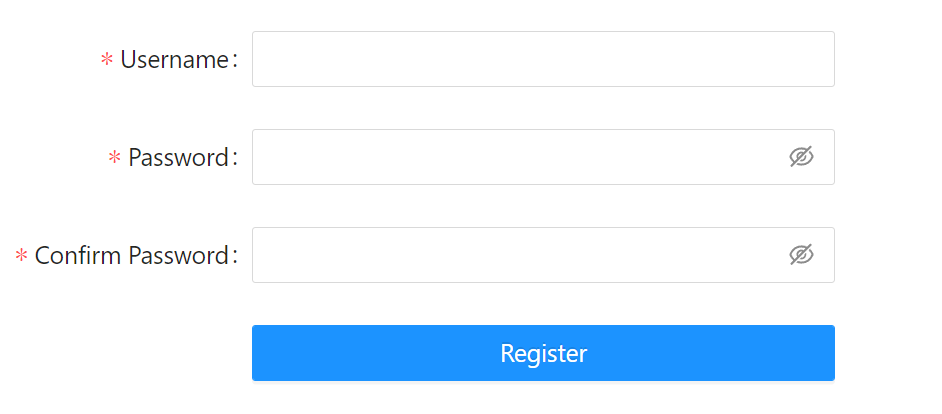
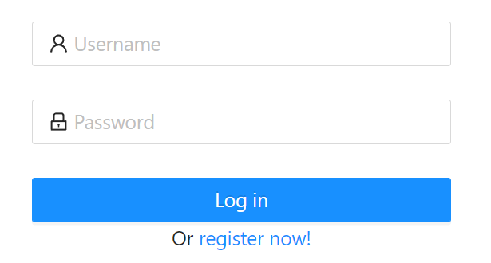
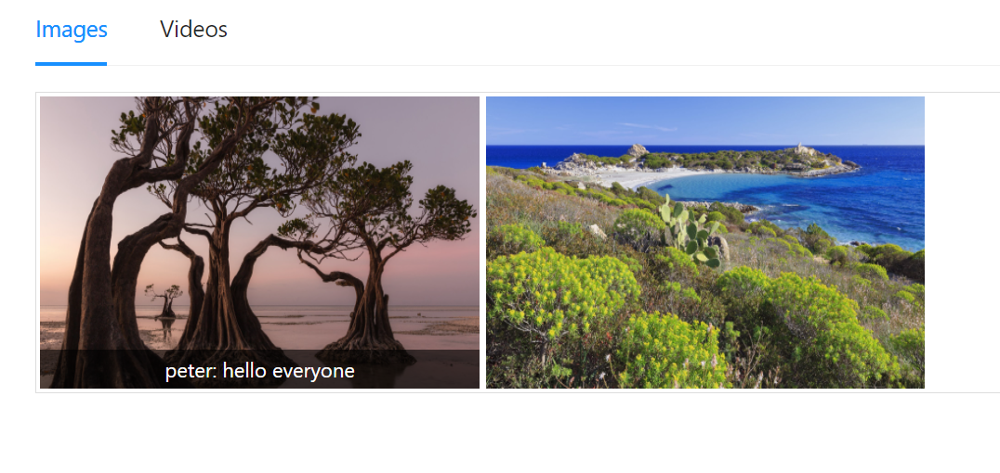
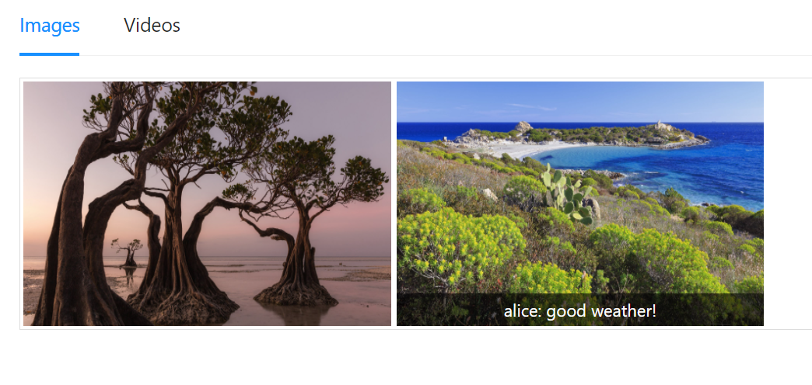
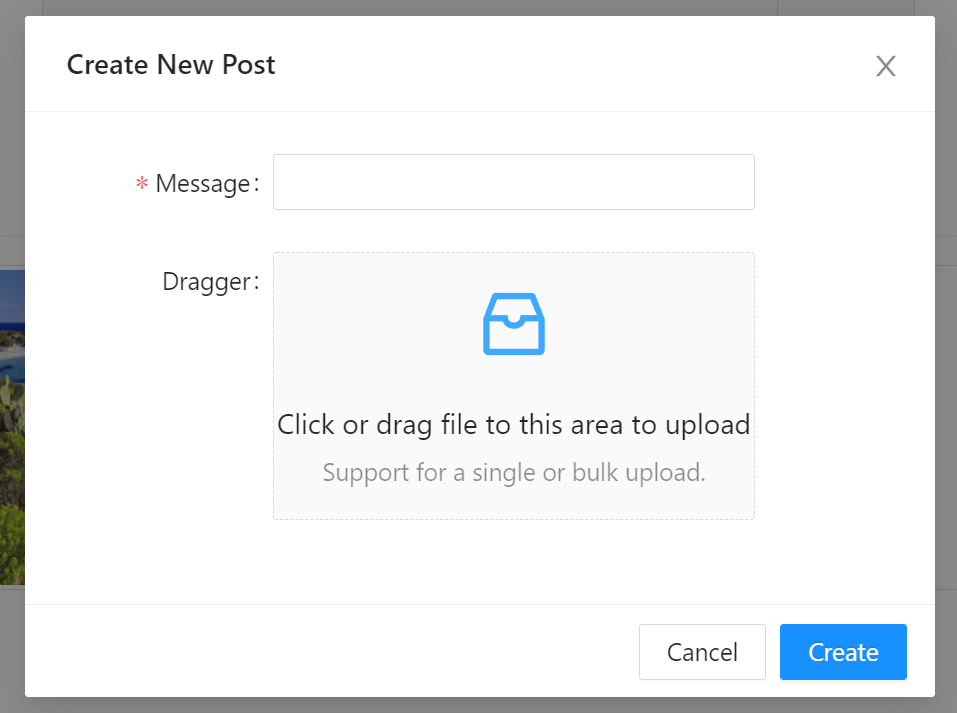
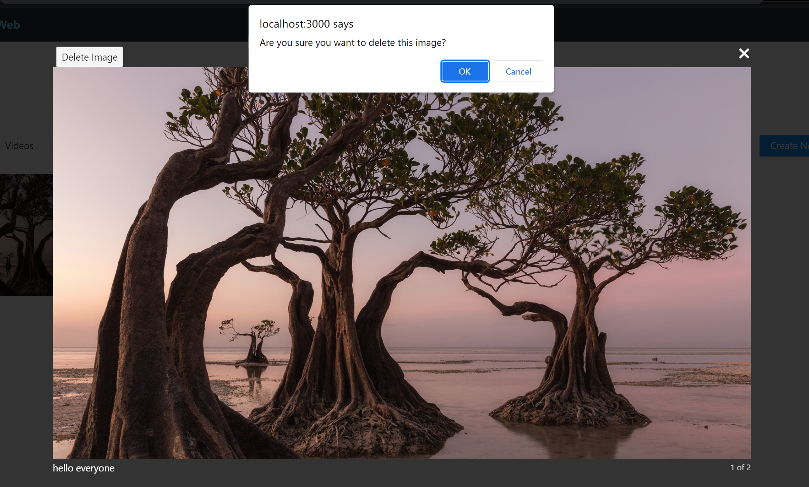
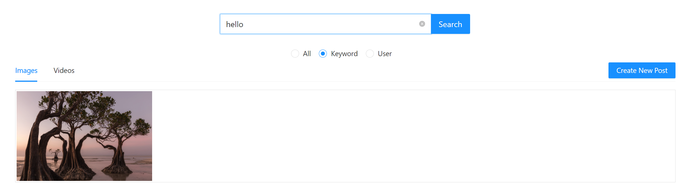
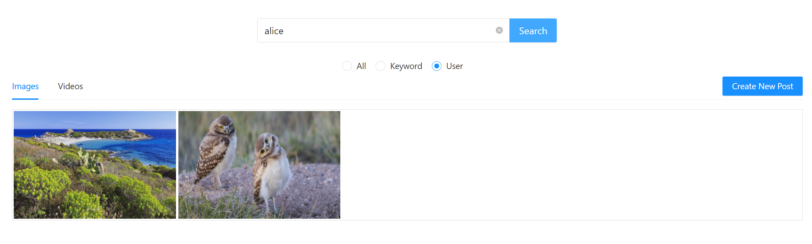
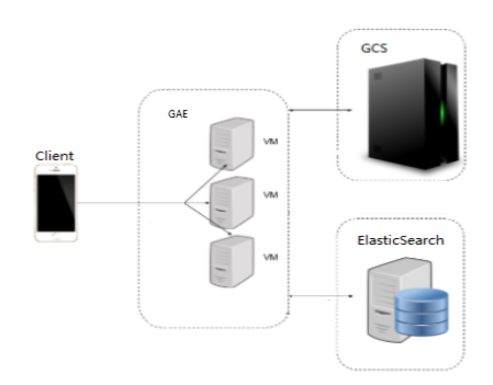

## Overview

This project is a social network web application developed with React and Go. It allows users to post their thoughts and browser other users' posts. They can also search what they are interested in by text keyword or user names. 

## Demo

Visit our website via this [link](https://master.dbyuaqemqqu9m.amplifyapp.com/). 

## Prerequsites

- [Git](https://git-scm.com/) is a version control tool.
- [Go](https://go.dev/dl/) is the programming language used in the project.
- [Elasticsearch](https://www.elastic.co/guide/en/elasticsearch/reference/current/install-elasticsearch.html#hosted-elasticsearch-service) is an open-source, distributed, RESTful search engine. We’ll use Elasticsearch as our Database in our project.

## How To Use

1. Get code

```bash
# Clone this repository
$ git clone git@github.com:peteryoungy/Mars.git

# Go into the repository
$ cd Mars
```

2. Run Elasticsearch, then add your Elasticsearch endpoint in the code.

3. Run the backend service.

```bash
# Run the app
$ go run main.go
```

4. Run the frontend. You can get detailed steps [here](https://github.com/peteryoungy/Mars-web).

## Features

- **Sign up and log in**

Users should register an account when they visit our website for the first time and then log in with the new account.

<p align='left'>
    
&nbsp; &nbsp;
    
</p>


-  **Browser posts**

All posts are sorted by "Images" and "Videos". Users can browser others posts in their home page. Hovering on the images will show the text post, while clicking on it will zoom in the picture. 

<p align='left'>
    
&nbsp; &nbsp;
    
</p>


- **Make a new post**

Users would like to make a new post by clicking the "Create New Post" buttom.

<p align='left'>
	    
</p>


- **Delete a post**

After zooming in the picture, click on the "Delete Image" button on the top left corner and then confirm to delete the post.

<p align="left">
	
</p>


- **Search what you like**

Search the posts by text keyword or users.

<p align='left'>
	
</p>

<p align='left'>
	
</p>

## Architecture

<p>
	
</p>

- Backend

The backend service is deployed on Google App Engine. App Engine is a fully managed, PaaS for developing and hosting web applications at scale. With simple config file, the service can be deployed with scalability which is managed by Google Cloud. 

- Database

Elasticsearch is used as the database. Image/video files are stored in Google Cloud Storage but not in es. In contrast, a unique object url referring to that object is stored in es.

## Contact

Yang Yu @[Yang Yu](https://github.com/peteryoungy)

